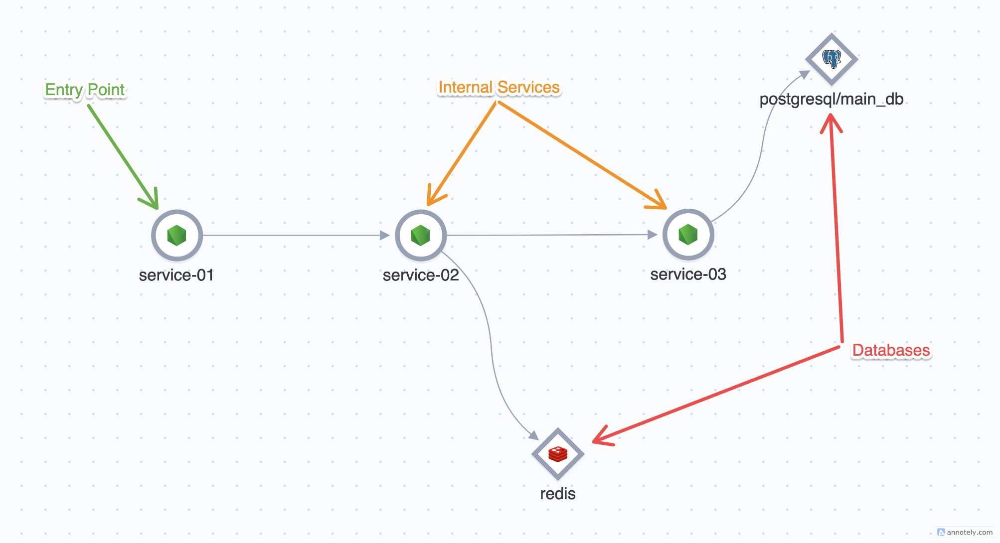
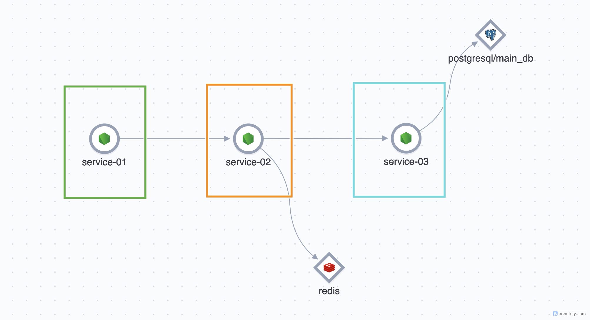
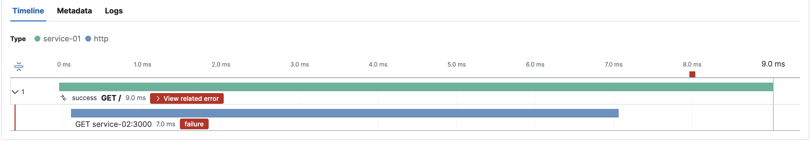
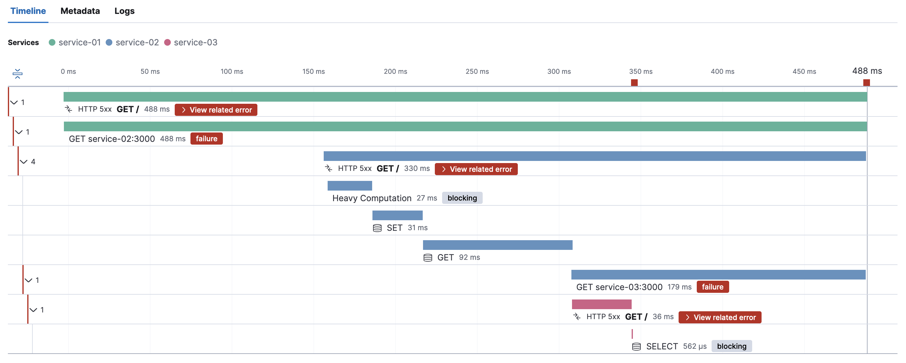
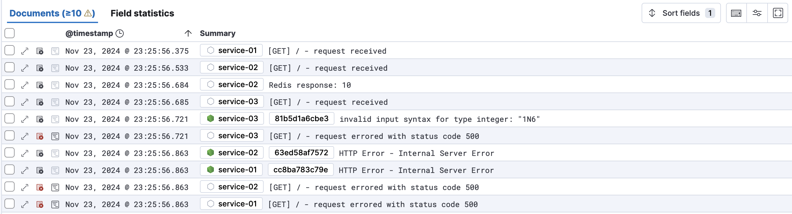

# End-to-end Observability

The goal of this demo is to illustrate the challenges in our current observability setup using a simplified example and propose a solution to address them.



We use multiple Azure Application Insights instances to organize telemetry by team, but this setup prevents distributed tracing across them. As a result, when a service from one team interacts with another team's service, we lose visibility into the complete flow.



Let's take an example of something failing in `service-01`



We see our request to `service-02` failed. But do we know what caused this?

- Do we have wrong business logic in `service-02`?
- Was `service-03` the one that crashed?
- Maybe it's one of our database queries.
- Did something happen to our infra and my services can't connect with postgres/redis?
- And many more...

> Going to the observability dashboard for `service-02` or `service-03` won't work, as it will be hard for us to co-relate transactions between them. And sometimes it might not even exist because of sampling.

## End-to-end Observability to the rescue

An end-to-end observability will let us see the entire transaction across all services and dependencies involved.



### Why does this matter?

We know exactly where the failure originated and who should we reach out to.
- Some service crashed? ping their owners.
- Infra issue? loop-in devops.

We also get the logs for the entire transaction, which gives us inportant information to debug.




---
To run this demo `docker` and `docker compose` needs to be installed.

```bash
docker compose up -d --build
```

Once all the containers start go to `https://localhost:5600` to go to kibana and login with this credentials `elastic:password`.